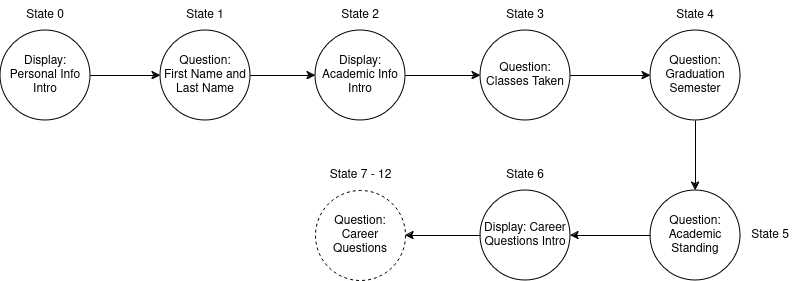

# Milestone.ai Architecture

## Introduction

### Purpose of document The purpose of this document is to describe the design and architecture of milestone.ai.

### Vision Statement
Around 2021 Kristi Brescia decided to create a document that displayed what
classes students should take at each semester of college and what extra-curricular
activities they should engage in, in order to increase their career readiness. This
document turned out to be successful. The goal of this application is to build upon
this document and make it more interactive. Students will not able be able to view
this static document, but interact with it by asking it questions and getting
individualized responses.

### Features of the application
- Users will get their personalized graduation milestone box
- User will be able to interact with a chatbot as the adviser

### Scope of the application


#### Must have
- Home page
- Info form
  - Graduation date
  - Number of credits
- Generate relevant milestone table
- Interactive chatbot
  - RAG

#### Should have

#### Could have
- User authentication
- Message saving

#### Wont have

### Architecture Goals
- Implement all necessary features
- Make all user interactions smooth and "reactive"
- Generate accurate llm responses
- Make application as dynamic

## Technology Stack

### Frontend layer
- html (structure)
- htmx (backend glue)
- tailwindcss (styling)
- alpine.js ("reactivity")

### Backend layer
- python (language)
- flask (framework)
- langchain (RAG)
- OpenAI (AI utils) (external api)

### Database layer
- sqlite (relational data)
- milvus (semantic data)

## Vector Database Design
- Purpose: the purpose of the vector database will store the contents of the gitbook.
  This will better aid the llm(large language model) response.
- Data source: https://csi-cs-department.gitbook.io/internship-handbook/sitemap.xml

- Collections
  - gitbook_data
    - refresh_rate := (based on last mod)

## Relational Database Design

### Tables

#### Admins
- id INT PRIMARY KEY
- username VARCHAR(30) NOT NULL UNIQUE
- email VARCHAR(255)
- password VARCHAR(200) NOT NULL // hash

## Backend Routes

### View

#### GET /
- home page: 

  - description: display information basic about application, button to go to the form

#### GET /get-to-know-you


- Response:
  - get-to-know-you.html
- Details:
  - This route checks whether the username has cookie USER_COOKIE_KEY, if so return response, else create an cookie initial state and store it in redis.
  - get-to-know-you.html calls `GET /form/state` on load
  - initial state has this format:
    ```json
    {
      "state": 0,
      "personal_info": {
        "first_name": "",
        "last_name": ""
      },
      "academic_info": {
        "classes_taken": [],
        "credits_taken": -1,
        "classification": "",
      },
      "career_info": {}
    }
    ```

#### GET /confirmation
- confirmation page: 

  - If no valid cookie, redirect to /get-to-know-you (pop up message)
  - generate a milestone map based on session data
  - description: will display the user's respective degree milestone map
  - optional: each actionable row might have a checkbox, this will give us information
  to what the user has done already
  - note: this can be added to `/get-to-know-you`

#### GET /chat
- chat page:


  - description: displays final personalized degree milestone map, 

#### GET /admin/login
- login page for admin: 

  - description: allows admin to login, master login

#### GET /admin
- admin page: 

  - description: allows user to update milestone map, allows admin to add or remove account,
  allows admin to set other admin permissions
  - redirects: `/admin/login` if not logged in

### Api

#### GET /form/state
- Response:
  - `templates/questions/*.html`
- Details:
  - validates the cookie
  - gets the current state from redis
  - returns the question corresponding to teh state


#### POST /form/state
- Request:
  - body: depends on the current state
- Response
  - `templates/questions/*.html`
- Details:
  - validates the cookie
  - gets the current state from redis
  - increments the state
    - if we're at the last state return a button that links to `GET /conformation`
  - returns the question corresponding current state

## Other

### State diagram


### Career questions to ask:
Year One - First Semester

    - Have you created a Handshake account with Career Services?
    - Did you draft a resume?
    - Have you reviewed your major's required courses?
    - Have you joined any student clubs?

Year One - Second Semester

    - Have you set up a LinkedIn account?
    - Did you explore career options for Computer Science majors?
    - Have you attended a hackathon?
    - Did you create a GitHub account?
    - Have you attended any professional development workshops?

Year Two - First Semester

    - Have you developed a network of contacts on LinkedIn?
    - Have you recently updated your resume?
    - Did you find a mentor for periodic check-ins?
    - Have you been active on your GitHub account?
    - Did you attend any recent professional development workshops?

Year Two - Second Semester

    - Have you contributed to any open source projects?
    - Did you apply for any internship prep programs like CUNY Tech Prep?
    - Have you launched a side project, such as a web or mobile app?
    - Have you participated in local hackathons or coding events?
    - Did you join any student professional organizations?

Year Three - First Semester

    - Have you crafted an effective resume?
    - Are you using LinkedIn to build your professional network?
    - Have you applied for internships?
    - Are you regularly posting to GitHub?
    - Have you attended any career fairs or professional events?

Year Three - Second Semester

    - Are you prepared for technical internship interviews?
    - Have you gained confidence in a specific tech stack beyond your classes?
    - Did you secure a software internship for the summer of your junior year?
    - Have you engaged in self-guided learning outside of class?
    - Did you participate in any virtual work experience programs?

Year Four - First Semester

    - Have you utilized Career & Professional Development events to enhance job search skills?
    - Have you met with a career advisor to review your resume, portfolio, and cover letter?
    - Did you inform your network about your job search?
    - Are you actively applying for jobs and tracking your applications?
    - Are you considering graduate school?

Year Four - Second Semester

    - Did you apply for internship prep programs like CUNY Tech Prep?
    - Have you initiated a side project, like a web or mobile app?
    - Are you contributing to open source projects?
    - Have you been involved in local hackathons or coding events?
    - Are you a member of any student professional organizations?
